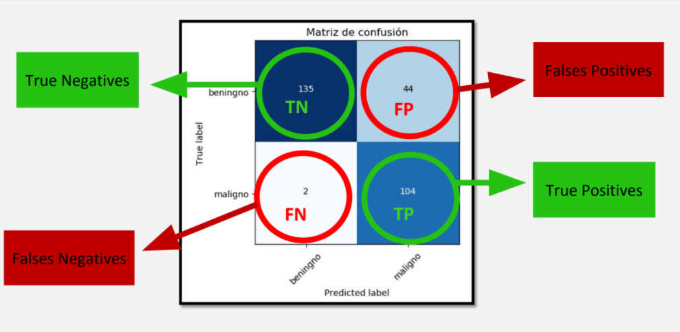

# Dip lenin Cheatsheet

+ ¿Qué ventajas tiene la utilización de NumPy?

    Permite realizar operaciones matriciales que de otro modo deberían realizarse de forma iterativa.

+ ¿Para qué es necesario Normalizar los valores en un dataset?

    Para facilitar el entrenamiento de los modelos de Machine Learning.

+ Luego de aplicar la normalización z-score:
  * Min-Max (0-1): poner todos los valores en un rango de 0-1. A cada una de las variables le resto el valor minimo y a eso lo normalizo por la diferencia entre el maximo y el minimo.
  
    ```x = (x - min(x)) / (max(x) - min(x))```

    El mínimo termina siendo siempre 0 y el máximo, 1 para todas las variables.
  * z-score: a cada variable restarle la media de esa variable y normalizarlo por la desviación estándar.

    ```x = (x - mean(x)) / std(x)```

    La media de cada distribución queda en 0 (ya que le resté la media a cada variable) y la desviación estándar en 1 para todas las variables (esto se da porque normalizo por la distribución).

+ ¿Qué hace la siguiente instrucción?: ```dataframe["GRASA"].mean()```

    Calcula el promedio para el atributo "grasa" del dataframe. Al array _dataframe_, específicamente a la columna _GRASA_ (ver que no especifica posición específica, por lo que entendemos que se trata de la columna), se le aplica la operación _mean_ que es el promedio.

+ ¿Qué hace la siguiente instrucción?: ```(dataframe["TIPO"]=="CC").sum()```

    Calcula la cantidad de registros que en la columna "tipo" tiene el valor "cc". Al array _dataframe_, primero se le aplica un filtro para que solo considere los campos con el valor _CC_. Luego se aplica la operación de numpy _sum_ sobre esto, que suma los registros y devuelve la cantidad.

+ ¿Qué hacen las siguientes instrucciones?: ```dataframe.name=pd.Categorical(dataframe.name); dataframe.name=dataframe.name.cat.codes```

    Reemplazan cada valor nominal en la columna "name" del dataframe por uno numérico entero distinto

    En la primera línea, se puede apreciar que se define la columna name del dataframe como categorical (es probable que tal columna contenga strings y que lo que se busque es traducir eso a integers para el procesamiento). Una vez convertido a categorical, la segunda línea le asigna a cada categoría (es decir, cada nombre) un número que lo identificará. De forma gráfica:

    <br>

    name | size | weight
    :---:|:---:|:---:
    caniche | 2 | 10.3
    caniche | 2 | 12.3
    sharpay | 5 | 20.4
    labrador | 9 | 50.2
    pequines | 3 | 25.9
    pequines | 5 | 27.4

    Name contiene a caniche, sharpay, labrador y pequines. El primer paso es definir la columna como Categorical. El segundo paso, es asignarle índices. La asignación podría ser la que sigue:

    ```asd
    caniche = 0
    sharpay = 1
    labrador = 2
    pequines = 3
    ```

    La tabla, entonces, quedaría así:

    name | size | weight
    :---:|:---:|:---:
    0 | 2 | 10.3
    0 | 2 | 12.3
    1 | 5 | 20.4
    2 | 9 | 50.2
    3 | 3 | 25.9
    3 | 5 | 27.4

+ Si un conjunto de datos tiene 20 ejemplos y 3 variables de entrada, para predecir una sola variable de salida ¿Cuál es es el tamaño de w?

    3x1. La clave está en que w es (_variables\_de\_entrada_ x _variables\_de\_salida_), en este caso, 3x1.

+ Si un conjunto de datos tiene 20 ejemplos y 3 variables de entrada, para predecir una sola variable de salida ¿Cuál es es el tamaño de b?

    Escalar (1x1). b se calcula siempre como (_variables\_de\_salida_ x 1), en este caso, 1x1.

+ Dada la siguiente salida de un modelo de regresión lineal junto con los valores esperados, calcule el error cuadrático medio (MSE).

    <br>
    <br>

    Salida de la red | Valor esperado o verdadero
    :---:|:---:
    2 | -1
    1 | 5
    -3 | -2
    0 | 1

    Las diferencias de cada fila son 3, 4, 1 y 1. Eso lo elevo al cuadrado, quedándome 3², 4², 1² y 1². Luego, la suma de diferencias al cuadrado es 9+16+1+1=27. Como hay 4 ejemplos, el promedio es 27/4 = 6.75.

+ Si tengo un parámetro w y su derivada respecto del error δE/δw, y una tasa de aprendizaje α, ¿cómo debo actualizar a w en base a la derivada, si estoy utilizando descenso de gradiente?

    w = w - α δE/δw. La fórmula a usar será la que sigue:

    ```parámetro = parámetro - (tasa_de_aprendizaje x derivada_respecto_error)```

+ Cuando termina el algoritmo de descenso de gradiente para regresión lineal utilizando error cuadrático medio, siempre se encuentra el mínimo global de la función de error.

    Falso, si bien siempre existe un mínimo global no siempre se encuentra exactamente. Esto es porque el algoritmo se detiene cuando encuentra que la función crece. Una función tiene muchos picos, no es posible asegurar que ese sea el mínimo global.

+ En el descenso de gradiente estocástico, si tengo 100 ejemplos, y un tamaño de lote (batch_size) de 5 ejemplos ¿Cuántas iteraciones (actualizaciones de parámetros) se realizan en una época?

    20\. N = 100; batch_size = 5. Las iteraciones reales por epoch están definidas como ```N / batch_size```, en este caso 100/5 = 20.

    Iteraciones reales totales: ```N / batch_size * epochs```.

+ Si un modelo obtiene un accuracy de 1 en el conjunto de entrenamiento y también en el conjunto de prueba

    No tiene sobreajuste (overfitting). Para que se de el overfitting, tiene que haber un error bajo en training pero alto en testing. En este caso, el accuracy es perfecto tanto en el conjunto de training como en el de testing.

+ Seleccione verdaderas:

  + Las redes neuronales “aprenden” mediante un algoritmo que intenta minimizar una función de error.

    No hay mucho para acotar...

  + Una red neuronal con muchas capas y muchas neuronas por capa podría generar un sobreajuste, ya que modelan polinomios complejos.

    Esto es asi ya que al ser cada vez mas complejo y tener tantas variables, en el intento de cubrir todo en el training, en realidad podria caer en errores en el testing.

  + Las redes neuronales son sensibles a la escala de los datos.

    Cuantos mas datos, mas complejo el asunto.

  + La capa de salida de una red neuronal tiene tantas neuronas como clases se desee clasificar.

    Por cada neurona, un tipo de clasificacion diferente.

  + La métrica “Accuracy” (pred. correctas/total) es susceptible al desbalance de clases.

    Si el dataset esta desbalanceado, el accuracy podria variar mucho porque se basa en una parte de la matriz sin ver la otra parte.

+ Dado el siguiente gráfico que muestra las curvas de accuracy en función de las épocas para el conjunto de entrenamiento y evaluación, elija la respuesta correcta sobre el modelo entrenado al finalizar el entrenamiento.

    

    El modelo sobreajusta (overfitting) al conjunto de entrenamiento y no será capaz de clasificar nuevos datos del mundo real. Esto se puede ver en la curva de entrenamiento que roza lo perfecto y la curva de evaluacion que tiende a ser baja.

+ Dada la siguiente matriz de confusión, calcule la métrica Accuracy. Escriba el resultado como un número entre 0 y 1.

    

    0.5. En la diagonal encontramos los ejemplos clasificados correctamente. Entonces son 10+10+5=25. Sumando el total de ejemplos (todas las celdas) hay 50. Entonces hay 25/50 de accuracy, o sea 1/2 o 0.5.

+ Dada la siguiente salida de una red neuronal junto con los valores esperados, calcule la métrica Recall

    

    0.3. Recall se define como TP/(TP+FN). En este caso, TP+FN son los casos en los que los datos eran originalmente de la clase 1, o sea TP+FN = 3. TP es la cantidad de aciertos de la clase 1, que en este caso fue una sola. Entonces recall = 1/3 = 0.33

+ Dada una red para reconocer 10 tipos de animales ¿Qué tipo de función de activación final y de error deben utilizarse?

    <br>
    <br>
    <br>
    <br>

    Tipo | Min. | Max. | Error | Problema
    :---:|:---:|:---:|:---:|:---:
    relu(x)|0|inf.|Error cuadrático medio|Regresión
    id(x)|menos inf.|inf.|Error cuadrático medio|Regresión
    sigmoidea(x)|0|1|Entropía cruzada binaria|Clasificación
    tanh(x)|-1|1|Error cuadrático medio|Regresión
    softmax(x)|0|1|Entropía cruzada|Clasificación

    NOTA: recordar que la softmax normaliza los valores para que sea más fácil clasificar.

    Sabiendo lo anterior, hay que pensar qué tipo de problema queremos resolver. En este caso, lo que se busca es reconocer 10 tipos de animales, es decir, clasificarlos, de ahí es que usaría una softmax con entropía cruzada.

+ Dada una red para calcular la edad de un animal en base a sus características ¿Qué tipo de función de activación final y de error deben utilizarse?

    Tomando de base la tabla anterior, dado que queremos generar un número real mayor a 0 (la edad), es un problema de regresión y por ende la función de error que corresponde es el ECM(MSE en inglés). Por otro lado, podemos utilizar una función de activación ReLu para predecir siempre valores mayores a 0, o directamente la salida de la red sin ninguna activación.

+ Dado un ejemplo cuya etiqueta de clase es 2, si tengo 5 clases, ¿cómo sería su codificación one-hot?

    (0,1,0,0,0). La notacion one-hot utiliza solo 0 y 1. En la etiqueta va el 1, el resto en 0. Dado que hay 5 clases es que es un quinteto.

+ Dada una imagen en escala de grises con dimensiones 10x10, si aplico un filtro convolucional de tamaño 5x5 sin padding ¿Cuáles son las dimensiones espaciales (alto x ancho) de la imagen de salida?

    Hay una fórmula para esto:

    ```asd
    H'=H+2*P-(K-1)
    W'=W+2*P-(K-1)

    Siendo que H es altura, P es padding y K es kernel. Todo depende de si lo que se busca es el alto o el ancho, respectivamente.
    ```

    En nuestro caso, H=10, P=0 y K=5. Podríamos haber también usando W en vez de H, pero com ambos valores son iguales es indiferente. Reemplazando en la fórmula: H'=10+2\*0-(5-1) --> H'=10+0-4 --> H'=6. Por lo tanto, la respuesta es 6x6.

+ Dada una imagen RGB con dimensiones 10x10x3, si aplico un filtro convolucional de tamaño 3x3 con padding de 1 pixel, ¿cuáles son las dimensiones espaciales (alto x ancho) de la imagen de salida?

    Nuevamente, aplicamos la fórmula. En este caso, H=10, P=1 y K=3. Reemplazando en la fórmula: H'=10+2\*1-(3-1) --> H'=10+2-2 --> H'=10. Por lo tanto, la respuesta es 10x10.

+ Dada una capa convolucional con 8 filtros de 5x5, que recibe como entrada una imagen RGB de 10x10x3, suponiendo que se utiliza padding de 2 pixeles, ¿Qué tamaño tendrá el Feature Map resultante de la capa?

    Nuevamente, aplicamos la fórmula pero con una consideración: hay más de un filtro, y esto se nota de manera diferente. Primero la fórmula: H=10, P=2 y K=5. Reemplazando en la fórmula: H'=10+2\*2-(5-1) --> H'=10+4-4 --> H'=10. Por lo tanto, la respuesta es 10x10. Ahora bien, son 8 filtros, por lo que la notación final será 10x10x8.

+ Una imagen RGB de tamaño 5x4 ¿Cuántos valores necesita para representarse?

    Si la imagen tiene de tamaño 5x4 = 20px, cada uno requiere 3 valores para representarse (por el RGB), 20x3=60.

+ Una imagen en escala de grises de tamaño 10x10 pixeles ¿cuántos valores necesita para representarse en memoria?

    Igual que antes: si el tamaño es 10x10 = 100px. Ahora bien, en vez de usar RGB estamos usando escala de grises, por lo que con un byte nos basta (2^8 = 256 valores para representar -> 8 bits -> 1 byte), por lo que multiplicamos al 100 x 1, y nos queda 100.

+ Si una capa convolucional recibe feature maps de tamaño HxWxC y devuelve feature maps de tamaño HxWxD ¿Cuál es el tamaño del kernel?

    El tamaño del kernel no tiene nada que ver con la cantidad de filtros!

+ Si una capa convolucional recibe feature maps de tamaño HxWxC y devuelve feature maps de tamaño HxWxD ¿Cómo se definiría en Keras?

    Conv2D(D). En Keras solo es necesario especificar la cantidad de filtros de salida, la capa conoce la cantidad de filtros de entrada automáticamente.

+ Dada una imagen en escala de grises con dimensiones 10x10, si aplico un filtro convolucional de tamaño 5x5 con padding de 2 pixeles ¿Cuáles son las dimensiones espaciales (alto x ancho) de la imagen de salida?

    Nuevamente, aplicamos la fórmula. En este caso, H=10, P=2 y K=5. Reemplazando en la fórmula: H'=10+2\*2-(5-1) --> H'=10+4-4 --> H'=10. Por lo tanto, la respuesta es 10x10.

## Unidad 1

1. Qué es el aprendizaje automático?

    El aprendizaje automatico es una rama de la inteligencia artificial que estudia mecanismos que permite a las computadoras aprender o predecir en base a experiencias. Extrae propiedades de los datos mas que depender de propiedades definidas por un experto.

2. Tipos de aprendizaje - _Supervisado_ vs. _No supervisado_
<br><br><br>
    Criterio | Supervisado | No supervisado
    :---:|:---:|:---:
    Definición | Cuando existe un conjunto de datos de los cuales **SE SABE** la clase a la que pertenecen | Cuando existe un conjunto de datos de los cuales **NO SE SABE** la clase a la que pertenecen
    Objetivo | Minimizar error de clasificacion | Descubrimiento de nuevos patrones

3. Aprendizaje supervisado - Tipos de problemas - Regresion vs. Clasificacion

    Criterio | Regresión | Clasificación
    :---:|:---:|:---:
    Resultado | Un número. Es decir, un valor numérico, dentro de un conjunto infinito de posibles resultados. | Una clase, entre un número limitado de clases. Con clases nos referimos a categorías arbitrarias según el tipo de problema.

4. Preprocesamiento y visualización

    El preprocesamiento tiene 3 pasos:
    + Revisar valores nulos/faltantes: un dataset real puede tener muchos registros corruptos.
    + Manejar datos nominales: pasar de texto a numeros.
    + Normalizar datos: los modelos de machine learning necesitan datos normalizados dado que es un problema que cada feature posea su propio rango de datos. La idea de normalizar es que todos los features manejen un mismo rango. Dos tecnicas para eso:
        + Min-Max (0-1): poner todos los valores en un rango de 0-1. A cada una de las variables le resto el valor minimo y a eso lo normalizo por la diferencia entre el maximo y el minimo.
        
            ```x = (x - min(x)) / (max(x) - min(x))```

            El mínimo termina siendo siempre 0 y el máximo, 1 para todas las variables.
        + Z-score (μ-σ): a cada variable restarle la media de esa variable y normalizarlo por la desviación estándar.

            ```x = (x - mean(x)) / std(x)```

    La visualizacion es clave para entender el dominio en el que estamos trabajando. Cuando hay mas de dos variables, la visualizacion podria no ser trivial.

## Unidad 2

1. Regresion Lineal
   - f(x) = mx + b
   - Es un modelo simple.
   - Asume relacion lineal entre x e y, por lo que es un modelo aproximado.
   - Parámetros:
     - m: pendiente.
     - b: ordenada al origen.
   - Usa Error Cuadrático Medio (funcion de error).

    La regresión lineal es un algoritmo de aprendizaje supervisado que lo que hace es “dibujar una recta” que indicará la tendencia de un conjunto de datos continuos.

    Recordemos que los algoritmos de Machine Learning Supervisados, aprenden por sí mismos y -en este caso- a obtener automáticamente esa “recta” que buscamos con la tendencia de predicción. Para hacerlo se mide el error con respecto a los puntos de entrada y el valor “Y” de salida real. El algoritmo deberá minimizar el coste usando una función de error cuadrático medio y esos coeficientes corresponderán con la recta óptima.

2. Error Cuadrático Medio

    El error cuadrático medio (ECM) de un estimador mide el promedio de los errores al cuadrado, es decir, la diferencia entre el estimador y lo que se estima.

3. Optimización de funciones

    Optimizar una funcion f es:
    + Buscar algun minimo.
    + Variar sus parametros.

    Hay dos tipos de algoritmos de optimizacion: 
    + Generales: asumen poco de f, tardan mas y tienen menos garantias. Ej: búsqueda aleatoria y fuerza bruta.
    + Especializados: todo lo contrario a los generales, pero no siempre son aplicables. Ej: camino mínimo de un grafo.

    El descenso de gradiente es un ejemplo de algoritmo general que asume que f es derivable (puede tener puntos de discontinuidad). Utliza el **gradiente** o **derivada** para la optimización, dado que la derivada en un punto indica la dirección de crecimiento de la función. Este algoritmo **NO** asegura el mínimo global, es decir, que podría dar un mínimo local. Este algoritmo es escalable a millones de ejemplos.

    Su funcionamiento es el que sigue:
	1. Empezar en un valor aleatorio del parametro.
	2. Iterar hasta que la derivada sea igual a 0. Cada cálculo de derivada indica la dirección en que crece la función, por lo que pasa encontrar el mínimo hay que ir para el lado contrario.
	3. Rogar que el valor final sea el mínimo global (podría dar un mínimo local).

	La ecuación fundamental que se itera es w = w - α δE(w)/δw, siendo:
    + w: el parámetro inicial aleatorio, 
    + α: la velocidad de aprendizaje
    + δE(w)/δw: la derivada de E (E es el error)

    El algoritmo iterará hasta converger. Mueve a w sub i en la dirección que minimiza E. w representa el punto y α δE(w)/δw es la direccion. δE(w)/δw es la direccion y magnitud del cambio, mientras que α es la magnitud del cambio (tamaño del paso), por lo que α δE(w)/δw es la direccion y magnitud del cambio.
	si α es chico, avanza lento y tarda mas; si α es grande tiene saltos grandes, puede no converger y eso da pie a errores numericos; si α es correcto, avanza relativamente rapido y el coste computacional es razonable

    Ventajas del descenso de gradiente:
	+ Es iterativo (o sea que es un while hasta que se cumpla la condicion y termine).
	+ Es generalizable (sirve para regresion lineal, regresion logistica, redes neuronales, etc).
	+ Es escalable (sirve para millones de ejemplos).

    1. Descenso de gradiente en regresion lineal

    La ecuacion de descenso de gradiente es perfecta para la regresion lineal, aunque hay que tener en cuenta que si las variables están sin normalizar, se estarán manejando diferentes escalas y parámetros, por lo que será más difícil encontrar el mínimo y llevará más tiempo.

4. Regresión Lineal Simple vs. Regresión Lineal vs. Regresión Lineal Múltiple

    Criterio | Regresión Lineal Simple | Regresión Lineal | Regresión Lineal Múltiple
    :---:|:---:|:---:|:---:
    Cant. variables de entrada | 1 | m | m
    Cant. variables de salida | 1 | 1 | m

5. Regresión Lineal Múltiple
   + Predice m valores a partir de n valores.
   + Transforma un vector en otro.
   + Ejemplos de uso:
     + Predicción de la posicion de un objeto a partir de una imagen.
     + Generar de un texto a partir de un sonido.
     + Generación de una imagen a traves de un vector de características.
     + Etc...
    + Cómo sería el descenso de gradiente en este caso?
      + Sumar errores cuadráticos de cada salida.
      + Error sigue siendo convexo (solución única).
    + **NO** es más potente que regresión lineal simple.

6. Descenso de gradiente tradicional vs. Descenso de gradiente Estocástico
<br><br><br><br><br><br><br><br><br><br><br><br>
    Criterio | Descenso de gradiente tradicional | Descenso de gradiente Estocástico
    :---:|:---:|:---:
    Aplicación | Gradiente con todos los ejemplos | Gradiente con lotes de ejemplos
    Exactitud | Gradientes más exactos | Gradientes ruidosos (sirve estadisticamente y es util para entrenar)
    Escape de mínimos locales | No puede escapar de mínimos locales | Puede que escape de mínimos locales
    Garantía del mínimo global | Si f convexa, garantiza mínimo global | Mínimo global no garantizado (utiliza una muestra de la muestra)
    Velocidad de ejecución | Lento | Rápido
    Escalabilidad | Poco escalable | Escalable

    Ejemplo de cálculo de iteraciones reales por epoch e iteraciones totales

    Ejemplo con N=8, batch_size=4, y epochs = 3
        Iteraciones reales por epoch = 2
            N/batch_size
        Iteraciones reales totales = 6
            N/batch_size*epochs

## Unidad 3

+ Clasificación binaria y predicción de probabilidades: la clasificacion es 0 o 1, no hay intermedios. Es un caso especial de probabilidad. Ejemplo, desaprobado o aprobado (0 o 1, respectivamente). Probabilidad involucra un rango de valores de 0 a 1. Es mas detallado.
+ Regresión Logística utiliza funcion sigmoide.
+ Regresión logística con múltiples variables de salida
	+ Permite realizar clasificación de más de 2 clases
	+ Función softmax se aplica luego de la regresión lineal
	+ Genera una distribución de probabilidades
	+ Entropía cruzada: error adecuado para la softmax
	+ Sigue teniendo una solución única (optimización convexa)
+ Límites de modelos lineales
	+ Hay problemas que Regresión Lineal o Regresión Logística no pueden resolver fácilmente (los que **NO** son linealmente separables).
	+ Transformar los ejemplos con varias regresiones aumenta el poder de los modelos.

+ Redes Neuronales
	+ Transforman vectores de entrada en vectores de salida.
	+ Regresión Lineal/Logística + Funciones de activación
		+ Transformaciones no lineales.
		+ Mayor poder de clasificación/regresión.
	+ Capas modulares: se pueden combinar de cualquier forma, dando lugar a arquitecturas o topologías.
	+ Topologías:
		+ Lineal.
		+ Aciclica.
		+ Cíclica.
	+ Algoritmo de entrenamiento para cualquier red si todas sus capas son derivables.
	+ Idea básica
		+ Apilar transformaciones.
			+ Regresiones lineales.
			+ Otras.
	+ Función de error: considerarla como una capa más (es una capa especial). No se usa para predecir.
	+ Descenso de gradiente: igual que antes, pero con más parámetros.
+ Keras vs. Tensorflow

    Criterio | Keras | Tensorflow
    :---:|:---:|:---:
    API | Alta (capas) | Alta y baja (tensores)
    Arquitectura | Simple, concisa y legible | No es fácil de usar
    Datasets | Pequeños | Grandes (performance muy alta)
    Debugging | Son redes simples, por que que el debugging rara vez es necesario | Es difícil debuggear
    Velocidad | Lento, baja performance | Rápido, buena performance

+ Evaluación de modelos
	+ Situaciones de accuracy:
		+ Train alto - Test alto
			+ Buen modelo
			+ Sirve para nuevos datos
		+ Train alto - Test bajo
			+ Modelo “bien” entrenado
			+ No sirve para nuevos datos.
		+ Train bajo - Test no importa
			+ Modelo mal entrenado
	+ Curvas de entrenamiento

		Las curvas de entrenamiento nos permiten ver cómo se comporta el modelo en cada iteración. No siempre la última iteración será el mejor modelo. La diferencia entre la curva de training y de testing nos permite visualizar el comportamiento del modelo con nuevos datos. También nos permiten visualizar errores en la configuración de los hiperparámetros.

	+ Sobreajuste (overfitting)

        El Overfitting ocurre cuando el modelo es muy complejo e intenta adecuarse perfectamente a los datos de entrenamiento. Podemos verificar el Overfitting si el error en Training es bajo y el de testing es alto. Si observamos las curvas de 
        aprendizaje podemos detectar el momento en que comienza el sobreajuste del modelo.

	+ Generalización: capacidad de un modelo para predecir datos no vistos (sin etiquetar). Se mide con el set de testing.
	+ Overfitting
		+ Predice bien train.
		+ No generaliza en test.
	+ Underfitting
		+ Predice mal train.
	+ Hiperparámetros: los hiperparámetros son los que guían el algoritmo de optimización de nuestro modelo. No existe una configuración ideal, sino que depende del modelo y del dataset específico.
	+ Regularización: la regularización es un modo de restringir la complejidad de un modelo. Es útil cuando hay mucha correlación entre features, para filtrar ruido en los datos y también para evitar el Overfitting.
+ Métricas para clasificación
    El error (entropía cruzada o MSE) nos permite saber cómo se ajustan las probabilidades del modelo pero no nos explica cuan bien clasifica el modelo. El Accuracy, por su parte, solo sirve como promedio de clasificación general del modelo.

	Una matriz de confusión permite visualizar el funcionamiento del modelo de clasificación. Las filas representan la etiqueta real de cada clase, mientras que las columnas representan la predicción del modelo entrenado. La diagonal principal representa el correcto funcionamiento del modelo. Fuera de la diagonal: errores.

    

	Benigno = 1; Maligno = 0 (las palabras me pierden).
    + TN(true negative): ejemplos que eran 1 y el modelo los clasificó como 1.
	+ FN(false negative): ejemplos que eran 0 y el modelo los clasificó como 1(Error).
	+ FP(false positive): ejemplos que eran 1 y el modelo los clasifico como 0(Error).
	+ TP(true positive): ejemplos que eran 0 y el modelo los clasifico como 0.

        

	+ Accuracy = (TP + TN) / (TP + TN + FP + FN)
		+ Forma para acordarme: (los que no son error)/(todo)
	+ Precision = TP / (TP + FP)
		+ Forma para acordarme: TP / (los que no son error)
	+ Recall = TP / (TP + FN)
		+ Forma para acordarme: TP / (lo positivo + lo negativo)
	+ El precision y el recall ambos empiezan con TP y divido por TP + F
		+ Si agrego p es precision.
		+ Si agrego n es recall.
	
    + Dataset desbalanceado (una clase es mayoritaria): ocasiona que el modelo “aprenda” a decir siempre lo mismo.
	+ A medida que inclinamos el peso hacia una u otra clase, aumentará el Recall y disminuirá el Precision, o viceversa.

## Unidad 4

imagen digital
	La estructura de una imagen es siempre una matriz de N x M pixeles.
	El pixel, entonces, es la unidad de información más pequeña en una
	Cada pixel representa un punto en la imagen, de un color particular.

Imagen digital - B&N valor 0 y 1 -> 1 bit
Imagen digital – Escala de grises 8 bits = 256 colores -> 1 byte
Imagen color

Modelo RGB
	Este modelo se basa en tres componentes de color: Rojo, Verde y Azul (Red, Green, Blue -
RGB).
	Entonces, para representar digitalmente una imagen color, se necesitan 3 matrices de NxM.
Una para cada canal.
	A mayor intensidad de luz en los 3 canales, los colores se aclaran. A menor intensidad, se
oscurecen.
	¿Qué cantidad de bits necesitamos para ver una imagen con “buena” calidad?
		Un byte para cada canal. Hasta el momento, el estándar 24 bits (8x3) TrueColor sigue siendo uno de los más utilizados.
		24 bits= 2^24 =16.777.216 colores

Histograma
	Un histograma es una representación de la distribución de los datos en una variable.
	Permite ver (estimar) la distribución de probabilidad de la variable.
	El rango de datos es dividido en N partes iguales (bins) y se contabiliza cuántos valores entran en cada rango.

Clasificación de imágenes

	Para crear un modelo que permita clasificar imágenes es necesario tener en cuenta algunas consideraciones:
		Las imágenes tienen los pixeles en formato matricial. Un modelo neuronal no acepta esto. Es necesario “aplanar” la imagen.
		Si es una imagen color, la cantidad de pixeles se triplica al tener los 3 canales.

Convolución

	Operación sobre dos funciones f y g, que produce una tercera función que puede ser interpretada como una versión “filtrada” de f.
	En funciones unidimensionales se utiliza para realizar diferentes filtros en señales o modelar estímulos en simulaciones.
	Si bien la convolución se define en forma continua, a nosotros nos interesa la versión discreta.

Convolución 1D discreta

	Parámetros:
		Kernel_Size: Es el tamaño del filtro utilizado.
		Stride: Es el número de saltos que da el filtro cada vez que se aplica.

Convolución - Padding

	Aplicar el filtro de forma discreta ocasiona dos problemas:
		Pérdida de información en los bordes.
		Reducción del tamaño final del vector.
	Para solucionar esto se suele utilizar la técnica de “padding”, generalmente rellenando con ceros.

Convolución 2D

Siguiendo la misma idea, podemos extender el concepto de convolución sobre matrices. Es decir, una convolución en 2 dimensiones. Esto nos sirve para imágenes en escala de grises.

Convolución 2D sobre datos 3D - ND

En imágenes RGB, nuestro kernel deberá tener una dimensión más:
	Kernel_Size= KxKx3 (tres por el rgb)

La convolución sigue siendo 2D pero se realiza sobre los 3 canales a la vez.

Capa convolucional

	Una capa convolucional no es más que muchos filtros convolucionales de tamaño K*K*C (K se debe definir y C = canales de la imagen).

Capas Pooling

	Las capas Pooling ayudan a reducir la dimensionalidad espacial del feature map. Básicamente son convoluciones con un stride igual al tamaño del kernel y donde se calcula alguna función sobre todos los píxeles. Lo más usual es el máximo, el mínimo o el promedio. No solo reducen la dimensionalidad, sino que generalmente ayudan en la clasificación.

Las Capas convolucionales 2D tienen filtros (kernels) que se entrenan para detectar diferentes características.
Cada filtro genera un Feature Map de NxNx1. Donde N dependerá del tamaño original de la imagen, del filtro, el padding y el stride que usemos.
Todos los Feature Maps de los distintos filtros de una capa convolucional se apilan, generando una nueva “imagen” (Activation Map) de NxNxF, siendo F la cantidad de filtros.
Las capas Pooling permiten reducir la dimensionalidad del problema, haciendo no solo más rápido el entrenamiento sino más eficaz al momento de generalizar.
El modo más ordenado de realizar una arquitectura ConvNet es intercalar capas Convolucionales con capas Pooling hasta llegar a las capas Dense (Feed-Forward) que discriminarán las características aprendidas por las capas anteriores.


